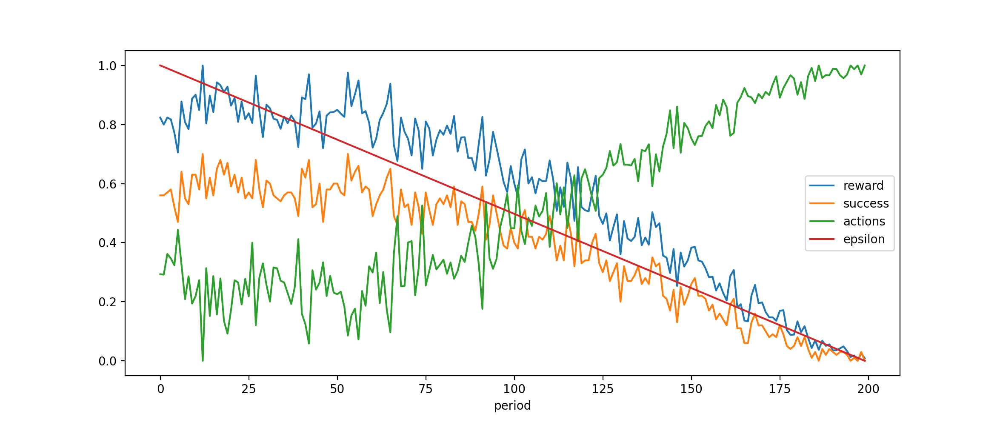
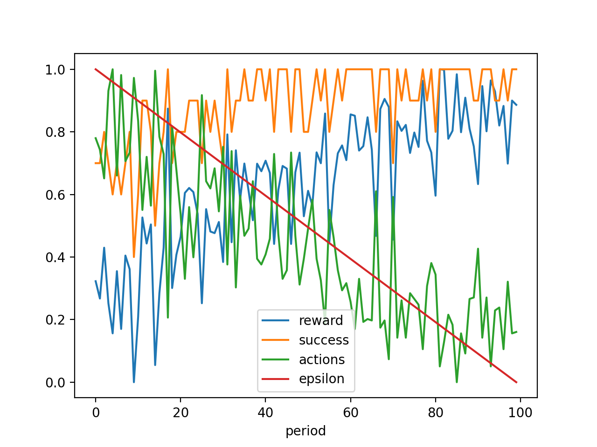
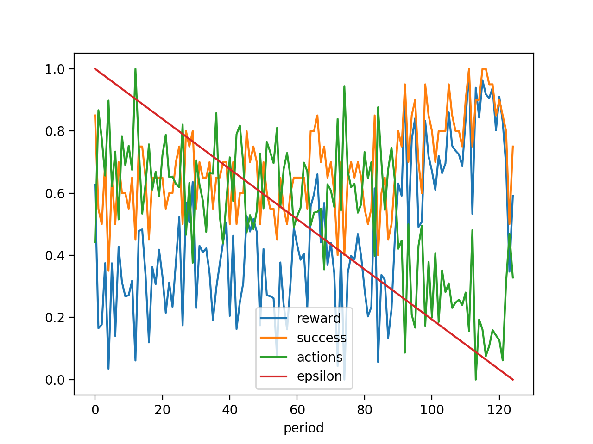

# Dungeon generator by Q-learning 

Summary


## Problem size and complexity

The problem is related with combinatory associations, and can be estimated as follows.

Let be `rows` and `cols` the number of columns and rows in the target maze/dungeon.

The maze is of regular shape, so the number of rooms `rooms_number` is `rows*cols`.

```
`rooms_number` = `rows` * `cols`
```

Each room is connected with its direct neighbors, thus forming a graph known as Grid Graph. The number of edges in this class of graph is 

```
`edges_number` = (`cols`-1)*`rows` + (`rows`-1)*`cols`
`edges_number` = 2*(`cols`*`rows`) - `cols` - `rows`
```

### Edges States

In the case of `cols=4` and `rows=4`, we have `24` edges. Each edge takes one state among two possibles states (`closed`/`open`).

```
`edges_states` = 2 **  `edges_number`
```

In the case of `4*4-maze`, `1'6777'216` edges configurations are possible.

### Keypoints States

There are 3 keypoints in the maze, placed in 3 distincts rooms. 

Their label is different, but in the current problem description, their actual respective place does not matter, as it does not change the maze difficulty, validity, etc. 

To lower the number of states, we consider them equivalent. The number of different configurations of keypoints is thus 

```
`keypoints_states` = Binomial(`rooms_number`, 3) = (`rooms_number`!)/(3! * (`rooms_number`-3)!)
```

In the case of `4*4-maze`, `560` keypoints configurations are possible.

### Mazes States

The combination of `keypoints_states` and `edges_states` grows **extremely** fast towards and `rows` and `cols`.

```
`states` = Binomial(`cols`*`rows`, 3) *  [2 **  (2*(`cols`*`rows`) - `cols` - `rows`)]
```

Of course, the vast majority of those `9'395'240'960` states are not valid mazes, because it may does not exist paths between keypoints, but they are suceptible to be encountered during generation, for example.

Moreover, by finding an rotation/symmetry invariant way to represent those spaces, we could divide by `8` this number, but it would not change the next steps. 

### State Encoding

We invite the reader interested in a maze's state encoding to read the documentation of `src/dungeon/dungeon.py` from `l.135` to `l.192`, especially the function `get_state_vector`.

Basically, we encode as state vector the concatenation of :

- a one-hot encoding of dims (`rooms_number`, 1) to indicate the `current_room` (see AI/Objectives)
- a "three-hot" encoding (`rooms_number`, 1) to indicated where the keypoints are placed
- a vector of dims (`edges_number`, 1) to indicated each edge state

For the `4*4` problem, we obtain a binary-valued vector of dim `56`.

## AI 

### Objective

We want to build an AI to generate some dungeons which are : 

- valid (important)
- obtained quickly (that's why we do not rely on fully-random or exhaustive enumeration)
- the most challenging/complicated possible (preferrably) 

Moreover, we want this AI to rely on Q-Learning concept, a method of reinforcment learning that can be quickly resumed as follows : discover randomly the set of environment states, and evaluates the reward obtained by an action. This reward is adjusted to a Q-Value, taking into account the actual reward received for the action, but the potential future rewards known from futures states. The idea is to play random actions less and less as the Q values estimations become more accurate.

An agent trained with this method can still keep a minimal ratio of random actions, and thus is well suited for non entirely deterministic behaviors, useful for data generation.

However, we can not fully rely on randomness, because the method would not scale to larger dungeons, as the ratio of valid/possible dungeons decreases very fast, hence the need of this AI.

### Rewards / Actions

Besides the ratio of random actions (characterized by `epsilon` value), it is nonetheless important to induce some variability in the way the agent will interact with the environment. 

To avoid the AI to learn to generate "only the best 4*4 possible maze", and to keep the action space small, we define the following set of rules to fulfill the objective :

- a dungeon is initialized with random keypoints (eventuallly a few random opened walls) to induce variability
- the dungeon is iterated over rooms, so each action is centered on a `current_room`
- two actions can be performed by `current_room`
- the board is entirely iterated two times maximum (to avoid infinite games and focus the learning)

#### Actions 

Actions are kept to only 3, thanks to the `current_room` added to the state. Having each wall "playable" at any time would be unconvenient to learn, as it would lead to a lot of divergence in the very early states
	
- `TOGGLE_WALL_DOWN` ; toggle bottom wall state
- `TOGGLE_WALL_RIGHT` ; toggle right wall state
- `NOP` : do nothing

#### Rewards

At each turn, the action chosen by agent yields a reward. 

First, we want to minimize the number of moves played by the agent to reach the goal. The initial reward for a move is not neutral but slightly negative, `-0.25`.

If the agent chooses an illegal move (toggle right wall in last column), an additional penalty of `-0.25` is applied.

With a few tests, it seems very important to solve this problem by reinforcment to provide progressive and regular rewards. While there is not an explicit formula to know if the agent is really progressing (especialy in the general case), some caracteristics of the underlying graph can help : 

- `difficulty` the sum of shortest paths length between keypoints (if they exist)
- `closeness` the sum of number of rooms accessible to keypoints
- `compounds` the number of connected compounds in the graph
- `max_compounds` the size of the biggest connected compound

We keep a record of the previous values for those features ; the reward is given accordingly with the variation (positive or negative) of those values.

Finally, if the agent goes through the dungeon two times without resolving it, a reward of `-50` is applied, which is the same magnitude of a "good resolution".

### Architecture used

In regular Q-Learning, we update a `state*action` table. Even with a reduced action space of 3 dimensions, the number of possible states is too large (at least for `4*4 mazes`) to be stored in a table. 

Maybe using a database instead of an in-memory table, encoding states up to matrices rotations/symmetry, we would be able to compute the `4*4` problem, but it would not scale at all for `5*5` for example.

Instead, I chose to use the Deep Q-Network method, replacing the Q-Table by a model, usually a neural network (hence the method's name), to estimate for a given state the Q-Value of each action.

With Deep Q-Network, the scaling for the `5*5` problem would be done by increasing the input layer to match dungeon's state vector, and probably re-adjust some hyperparameters, not a huge deal compared with the size increasing of a regular Q-Table.

### Hyperparameters tweaking

The indicator to monitor is the success rate or the number of moves needed by AI to finish the game towards epsilon ; as epsilon decreases over games played (epochs), two typical phenomenons are likely to happen :

- the success rate follows epsilon
- the number of moves follows epsilon

Success rates and number of moves are obviously related, and picture in their way how well the AI understood rules and plays efficiently.



If by decreasing epsilon, and thus relying more on learnt situations, this ability decreases, then it shows the learning process has not been successful. Grossly speaking, the AI has likely been released in the wild "too soon" or "too late", so we should adjust :

- learning rate
- Q-network model architecture 
- batch size used for replay
- epsilon decreasing / epsilon min value
- discount rate (how longer-term rewards are valued towards short-term ones)

If tweaking those parameters does not change anything in the AI training success, it may indicate the way rewards are granted is the actual problem ; progressive rewards are usually a better way to process.

### Results

Models have been trained from simplest (3x3, fixed) to hardest (4x4, random) problems to validate rewards strategy before going for long trainings. 

In particular, the 3*3 dungeons are quite well solved.



Some 4*4 show convincing efficacity as well, besides the fact they are more sensitive to hyperparameters, and can end up not playing much better than random. Anyway, some models show certain ability to learn, even in the random variant.



The selected model performs a success rate of 76.2% on a batch of 500 random dungeons, with an epsilon kept to `0.1` (10% of moves are random). See the `test.py` script.

|                   | Success         | Average Moves |
|-------------------|-----------------|---------------|
| DQN Agent eps=0.1 | 381/500 (76.2%) | 24.64         |
| Random Agent      | 289/500 (57.8%) | 35.61         |


#### Next steps 

The following adaptations could lead to better results. They are ordered by necessary workload :

 - Use a learning rate scheduler
 - Use a batch_size scheduler
 - Test other rewards methods ; at the moment, the AI removes too many walls
 - use Double Deep Q Network architecture [https://arxiv.org/abs/1509.06461](DDQN), which seems more efficient in learning phase

## Software Architecture

### Dungeon 

This class implements the model besides the environment, the dungeon/maze itself. See the code for further details, but methods are separated in sections : 

- construction of data struct 
	- edges/rooms dict
	- adjacency list updated at each edition
- model edition functions (room/walls)
- encoding related functions
- graphs features related functions useful to compute rewards
- random based editions

To have an overview of class usage, see `test()` function.

```python
from dungeon.dungeon import Dungeon

Dungeon.test()

# or execute the folowing block

dungeon = Dungeon(4, 4)
print("\nPrint as Matrix")
print(dungeon.as_matrix())

print("\nPrint as Vector")
print(dungeon.as_vector())

print("\nPrint as pretty Matrix (Pandas)")
print(pd.DataFrame(dungeon.as_matrix()))

# Iterators 

#for (i, j, index) in dungeon.room_iterator() :
#	print((i, j, index))
print("\nRoom flat iteration")
print([ (i, j, index) for (i, j, index) in dungeon.room_iterator() ])
print("\nRoom iteration by rows")
print([row for row in dungeon.room_iterator(flat= False) ])

print("\nEdge Iterator")
for (A, B, i) in dungeon.edge_iterator() :
	print(dungeon.edges[i])

print("\nInitial djacency List")
print(dungeon.adjacency_list)

print("\nDungeon Edition")
# method 1 : overrides existing edge
dungeon.add_edge(Edge("1", "2", "1-2",True))

# method 2 : use higher level function
dungeon.open_wall("2-6")
# dungeon.open_wall("1-5")
dungeon.toggle_wall_down("1")
dungeon.open_wall("3-4")
dungeon.open_wall("12-16")
dungeon.open_wall("6-7")
dungeon.open_wall("6-10")
dungeon.open_wall("5-6")
dungeon.open_wall("10-14")
#dungeon.open_wall("14-15")
dungeon.toggle_wall_right("14")
dungeon.open_wall("15-16")
dungeon.open_wall("8-12")

dungeon.place_keypoint('1', "In")
dungeon.place_keypoint('8', "Out")
dungeon.place_keypoint('7', "*")

print(dungeon.adjacency_list)

print("\nKeypoints")
print(dungeon.keypoints)

print("\nShortest Paths")
print("1 -> 7 : %s" % (dungeon.shortest_path('1', '7')))
print("1 -> 8 : %s" % (dungeon.shortest_path('1', '8')))
print("1 -> 5 : %s" % (dungeon.shortest_path('1', '5')))
print("1 -> 4 : %s" % (dungeon.shortest_path('1', '4')))

print("\nString Representation\n")
print(dungeon)

print("\nTuple Representation")
print(dungeon.as_tuple())

print("\nMatrix Representation")
print(np.array(dungeon.as_adj_matrix()))

print("\nFingerprint")
print(dungeon.state_fingerprint()) # -> 3b4b6b18085313f8

print("\nState Vector")
print(dungeon.get_state_vector())

print("\nDifficulty estimation")
print(dungeon.compute_difficulty())
```

### Environment 

This class acts as a wrapper for a `Dungeon`, and implements rewards/actions mechanisms available to agents, which would be outside the dungeon's scope.

It consists in creating a dungeon with all waalls closed, and populates it with keypoints following three levels of difficulty :

- `1`, rooms are fixed in `1`, `7`, `9`
- `2`, rooms are placed randomly
- `3`, rooms are placed randomly, and a few walls are open

It also implements rewards describded above.

### Agent 

The AI we develop is contained in a Agent, which interacts with the above environment, and adapts its strategy/policy according to the rewards he receives while training

### Usage

#### Train

The script `train.py` trains an agent how to resolve a particular problem, given some parameters 

- Game related parameters
	- `ROWS`, `COLS`
	- `LEVEL`
- Learning related parameters
	- `LEARNING_RATE`
	- `EPOCHS`
	- `MEMORY_SIZE`, `BATCH_SIZE`
	- `GAMMA`
	- `EPSILON`, `EPSILON_MIN`

By default, running this script will train an AI to resolve 4*4 random mazes.

#### Test 

The script `test.py` loads a previously trained agent and lets it play a new game, printing all its move choices, and the result obtained, with the number of actions needed.

By default, running this script will perform a 4*4 random maze resolution.

```bash
python test.py --rows=4 --cols=4 --randomness=0.1 --tests=10

...
finished in 22 actions
:--:--:--:--:
|O          |
:  :  :  :--:
|I |        |
:--:  :  :--:
|  |        |
:--:  :  :--:
|  |  |* |  |
:--:--:--:--:
...
finished in 48 actions
:--:--:--:--:
|           |
:  :--:  :--:
|  |   I    |
:  :  :  :  :
|  |        |
:  :  :  :  :
|O |  |* |  |
:--:--:--:--:
...
finished in 25 actions
:--:--:--:--:
|         I |
:  :  :  :--:
|  |  |     |
:  :  :--:--:
|O |        |
:--:  :  :  :
|*    |  |  |
:--:--:--:--:
Successes : 9/10 (90.0%)
```
